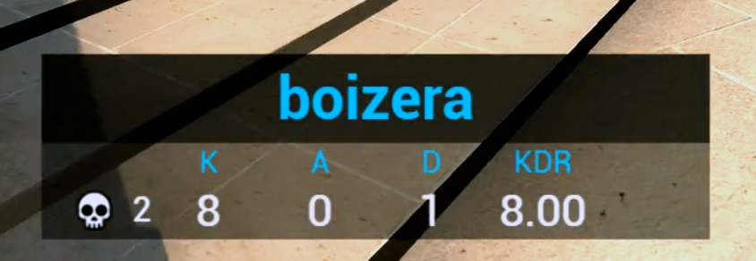

# CSGO stream overlay with Game State Integration
Small webpage to display live stats from your Counter-Strike: Global Offensive gameplay to overlay on your livestream in the same style as seen on professional CSGO esports broadcasts

## Prerequisites
Apart from CSGO and the files in this project you need to install [Node.js](https://nodejs.org/en/) to run the local server which will recieve updates from the game and forward it to your webpage.

## Installation 
1. Add `gamestate_integration_overlay.cfg`to the config folder in your CSGO installation. This folder is typically located at `C:\Program Files (x86)\Steam\steamapps\common\Counter-Strike Global Offensive\csgo\cfg`. The contents of this file largely follow the example from [Valve](https://developer.valvesoftware.com/wiki/Counter-Strike:_Global_Offensive_Game_State_Integration). 

2. Open PowerShell or Command Prompt in the directory where `gsiserver.js` is located and enter
`node gsiserver.js`
You should see the output "Currently listening at...". This file also follows Valve's example but is modified to also recieve GET requests from websites or other software you might want to use. Leave the windows open for as long as you want to use the overlay as closing the window shuts down the local server.

3. To add an overlay to your livestream you have to add `overlay.html` as a source to your streaming software. I will explain the process for [OBS](https://obsproject.com/) but it should work in a similiar fashion with other software. 
   - Add Source > Browser and give it a fitting title
   - Check the box for "Local file" and select `overlay.html`
   - I recommend changing the size to Width: 450 and Height: 150
   - Use `body { background-color: rgba(0, 0, 0, 0); overflow: hidden; }` as your Custom CSS
You should now see a semitransparent black box on your preview window that will later include your live stats. Adjust the size and position to your liking. 

4. The box will get filled with life once you start playing CSGO! 

## Features
The design of the overlay closely follows the style you see on broadcasts of CSGO esports, but has been adjusted due to technical limitations and reduced in complexity as it is meant for streamers who broadcast their own gameplay therefore making certain stats (armor value, health value, ammo count etc.) reduntant since they are already part of the game's HUD. 
On professional broadcasts this box includes an ADR (Average Damage per Round) stat, which is not possible here since CSGO's Game State Integration doesn't send this information. It has been replaced by KDR (Kill-Death Ratio). 

- Displays your Steam profile name
- Displays your total kills, assists and deaths in the match
- Displays the amount of kills you got in the current round accompanied by a small skull
- The accent colour changes depending on the team you're on (orange for T-side, blue for CT-side)
- The name and stats will update to the currently spectated player when dead or in GOTV

## Limitations
This overlay is designed for live stats from classic competitive matches, but it might work in other game modes (like Team Deathmatch or Casual) too. 
Other features such as the possibility to add your flag and team logo might come later. Feel free to contribute to this project, report bugs, or give suggestions. 

GLHF! 
